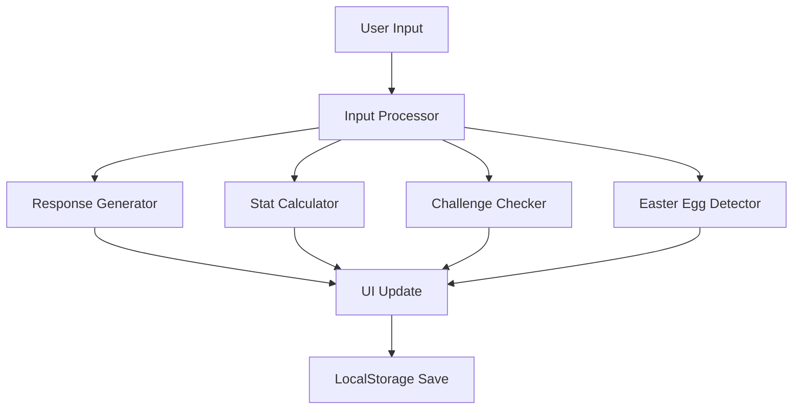

# Detect Aukad 🎯

<div align="center">

https://img.shields.io/badge/Detect-Aukad-brightgreen
https://img.shields.io/badge/version-2.0.0-blue
https://img.shields.io/badge/license-MIT-green
https://img.shields.io/badge/HTML5-E34F26?logo=html5&logoColor=white
https://img.shields.io/badge/CSS3-1572B6?logo=css3&logoColor=white
https://img.shields.io/badge/JavaScript-F7DF1E?logo=javascript&logoColor=black

A hilarious Hinglish/Banglish browser game that determines if you have the "AUKAD" (status/wealth/level) to do whatever you type!

Play Now • Features • Installation • Contributing

</div>

📖 Table of Contents

- Overview
- Features
- Quick Start
- Installation
- Gameplay
- Technical Details
- API Reference
- Contributing
- License
- Support

# 🌟 Overview

Detect Aukad is an entertaining browser-based game that combines humor, psychology, and gamification. Players type anything into a text box and receive randomized funny responses in Hinglish (Hindi+English) or Banglish (Bangla+English) that determine whether they have the "Aukad" (social status/wealth/level) to accomplish what they typed.

The game features **advanced stat mechanics, trophy systems, challenges, Easter eggs, and persistent progress saving using localStorage.**

# ✨ Features

## 🎮 Core Gameplay

· Randomized Responses: 50+ hilarious Hinglish/Banglish responses with emojis
· Dual Language Support: Switch between Hinglish and Banglish modes
· Stat System: Track Wealth, Social Level, and Crazy Points
· Aukad Level: Progressive leveling system from 0-100
· Smart Challenge System: 25 unique challenges that appear only once

## 🏆 Achievement System

· 40+ Trophies: Earn unique trophies like "Chotta Rocket Owner", "Supreme Aukad Guru"
· Progressive Unlocks: Trophies based on milestones and special actions
· Visual Trophy Case: Display all earned achievements

## 🎯 Advanced Mechanics

· Balanced Stat Scaling: Logical progression based on input characteristics
· Easter Egg System: 35+ hidden triggers with special responses
· Persistent Storage: Automatic save/load using localStorage
· Challenge Completion: Bonus rewards for completing challenges

## 🎨 User Experience

· Playful Design: Colorful, engaging interface with smooth animations
· Responsive Layout: Works perfectly on desktop and mobile devices
· Visual Feedback: Animated stat changes and notifications
· Share Feature: Copy your Aukad status to clipboard

## 🚀 Quick Start

Visit It to play the website:
```
https://detect-aukad-home.onrender.com
```

# 🎮 Gameplay Guide

## Basic Gameplay

1. Type anything in the input box
2. Click "Check Aukad" or press Enter
3. Receive hilarious response about your Aukad level
4. Watch your stats change based on what you type

## Stat Mechanics

· Wealth: Increases with longer, more complex messages
· Social Level: Grows with well-structured sentences
· Crazy Points: Boosted by creative and unusual inputs
· Aukad Level: Overall progression indicator (0-100)

## Challenge System

1. Click "Get Challenge" for a random task
2. Complete the challenge by typing the required content
3. Earn bonus stats and trophies for completion
4. Each challenge appears only once per game session

## Trophy System

Trophies are earned through various achievements:

· Milestone Trophies: Reaching specific Aukad levels
· Action Trophies: Performing specific typing patterns
· Challenge Trophies: Completing special challenges
· Random Trophies: Surprise awards for creative inputs

## Language Switching

Toggle between Hinglish and Banglish modes:

· Hinglish: Hindi-English mixed responses
· Banglish: Bangla-English mixed responses
· Language preference is saved automatically

## 🔧 Technical Details

Architecture



## localStorage Schema

```javascript
{
  "aukadLevel": number,           // 0-100
  "wealthValue": number,          // Monetary wealth
  "socialValue": number,          // 0-100 social status
  "crazyValue": number,           // 0-100 crazy points
  "earnedTrophies": string[],     // Array of trophy names
  "usedChallenges": string[],     // Completed challenges
  "currentLanguage": string       // "hinglish" or "banglish"
}
```

## Response Generation Algorithm

```javascript
function generateResponse(input) {
  const languageResponses = currentLanguage === "hinglish" ? hinglishResponses : banglishResponses;
  const randomResponse = languageResponses[Math.floor(Math.random() * languageResponses.length)];
  const randomEmoji = emojis[Math.floor(Math.random() * emojis.length)];
  return randomResponse + " " + randomEmoji;
}
```

## Stat Calculation Formula

```javascript
function calculateAukadChange(length, words) {
  let change = 0;
  if (length > 40) change += 4;
  else if (length > 20) change += 2;
  else if (length > 10) change += 1;
  else change -= 1;
  
  if (words > 8) change += 3;
  else if (words > 4) change += 2;
  else if (words < 2) change -= 2;
  
  return change;
}
```

# 🤝 Contributing

We love contributions! Here's how you can help:

## Reporting Bugs

1. Check existing issues to avoid duplicates
2. Create a detailed bug report with:
   · Browser version
   · Steps to reproduce
   · Expected vs actual behavior
   · Screenshots if applicable

## Suggesting Features

1. Check existing feature requests
2. Describe your idea clearly
3. Explain the benefits and use cases

## Code Contributions

1. Fork the repository
2. Create a feature branch: git checkout -b feature/amazing-feature
3. Commit your changes: git commit -m 'Add amazing feature'
4. Push to the branch: git push origin feature/amazing-feature
5. Open a Pull Request

## Development Guidelines

· Follow existing code style
· Add comments for complex logic
· Test changes across different browsers
· Update documentation as needed

📄 License

This project is licensed under the MIT License - see the LICENSE file for details.

```
MIT License

Copyright (c) 2024 Detect Aukad

Permission is hereby granted, free of charge, to any person obtaining a copy
of this software and associated documentation files (the "Software"), to deal
in the Software without restriction, including without limitation the rights
to use, copy, modify, merge, publish, distribute, sublicense, and/or sell
copies of the Software, and to permit persons to whom the Software is
furnished to do so, subject to the following conditions:

The above copyright notice and this permission notice shall be included in all
copies or substantial portions of the Software.

THE SOFTWARE IS PROVIDED "AS IS", WITHOUT WARRANTY OF ANY KIND, EXPRESS OR
IMPLIED, INCLUDING BUT NOT LIMITED TO THE WARRANTIES OF MERCHANTABILITY,
FITNESS FOR A PARTICULAR PURPOSE AND NONINFRINGEMENT. IN NO EVENT SHALL THE
AUTHORS OR COPYRIGHT HOLDERS BE LIABLE FOR ANY CLAIM, DAMAGES OR OTHER
LIABILITY, WHETHER IN AN ACTION OF CONTRACT, TORT OR OTHERWISE, ARISING FROM,
OUT OF OR IN CONNECTION WITH THE SOFTWARE OR THE USE OR OTHER DEALINGS IN THE
SOFTWARE.
```

🐛 Known Issues

Browser Compatibility

· Safari: localStorage may have size limitations
· Mobile Browsers: Touch interactions may need optimization
· IE11: Not supported (use modern browsers)

Performance Considerations

· Large trophy collections may impact rendering
· Frequent localStorage writes can affect performance
· Animation performance on lower-end devices

Limitations

· Maximum Aukad Level: 100
· Maximum challenges: 25 per session
· Trophy storage limit: Browser-dependent

🔮 Future Roadmap

Version 2.1.0 (Planned)

· Multiplayer functionality
· Leaderboard system
· Additional language support
· Sound effects and music

Version 2.2.0 (Concept)

· Advanced AI response generation
· Social media integration
· Custom theme support
· Plugin system for extensions

Version 3.0.0 (Long-term)

· Mobile app versions
· Cloud synchronization
· Advanced analytics
· Community features

📊 Analytics Integration

Basic Implementation

```javascript
// Add to track user interactions
function trackEvent(category, action, label) {
  if (typeof gtag !== 'undefined') {
    gtag('event', action, {
      'event_category': category,
      'event_label': label
    });
  }
}
```

Privacy-First Approach

· No personal data collection
· Anonymous usage statistics only
· Opt-in analytics where implemented

🌍 Localization

Current Languages

· Hinglish: Hindi + English mix
· Banglish: Bangla + English mix

Adding New Languages

1. Create new response arrays
2. Add language toggle functionality
3. Update localStorage handling
4. Test all game features

💡 Tips & Tricks

Pro Gameplay Tips

· Longer messages generally increase stats faster
· Varied vocabulary triggers more Easter eggs
· Complete challenges early for bonus rewards
· Switch languages for different response styles

Easter Egg Hunting

· Try typing common words like "pizza", "rocket", "money"
· Use emojis in your messages
· Mention different topics (sports, music, technology)
· Be creative and unpredictable!

Trophy Collection Strategies

· Aim for specific stat milestones
· Complete all available challenges
· Experiment with different message types
· Check trophy case regularly for new unlocks

🆘 Support

Getting Help

· Documentation: Check this README first
· Issues: Use GitHub Issues for bugs and feature requests
· Discussions: Join community conversations
· Email: Contact maintainers for direct support

Community Resources

· Wiki: Game guides and tutorials
· Examples: Sample gameplay strategies
· Templates: Customization examples
· Showcase: Community creations

🙏 Acknowledgments

Contributors

Thanks to all the amazing contributors who have helped make Detect Aukad better!

Inspiration

· Classic text-based games
· Indian internet culture and humor
· Gamification psychology principles
· Community feedback and suggestions

Technologies Used

· HTML5: Modern web standards
· CSS3: Advanced styling and animations
· JavaScript ES6+: Modern JavaScript features
· LocalStorage API: Persistent data storage

---

<div align="center">

Made with ❤️ and lots of 😂 by the Detect Aukad Team

⭐ Star this repo • 🐛 Report Issue • 💡 Suggest Feature • 📖 Documentation

Keep typing, keep laughing, and always know your Aukad! 🎯

</div>